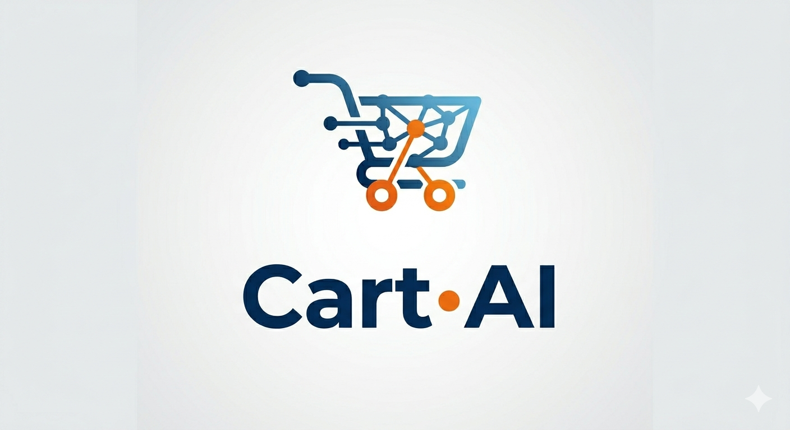
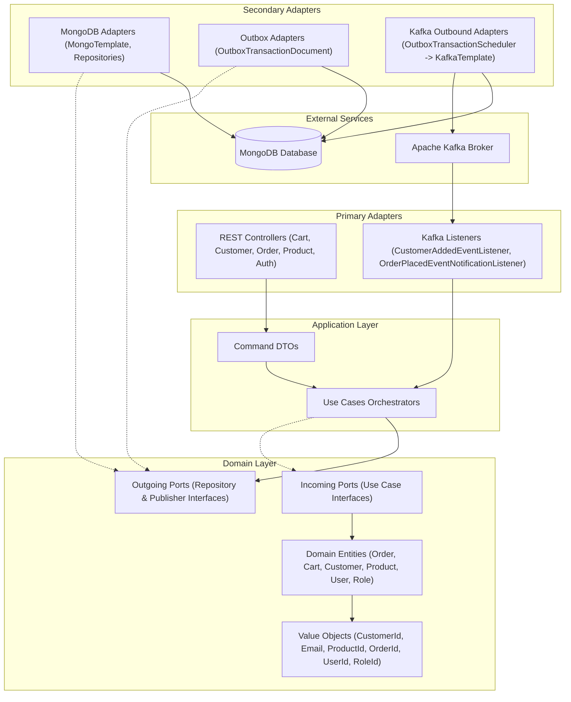

# Cart·AI Shopping



Cart·AI Shopping is a modern e-commerce backend platform built using clean coding practices, microservices design
patterns, and robust event-driven architecture.

This project is built using **Hexagonal Architecture (Ports & Adapters)** to keep business logic completely decoupled
from external frameworks, database technologies, and messaging systems.

---

## 🏛️ System Architecture

The project follows a pure Hexagonal Architecture separation, ensuring that the domain model remains free of
infrastructure concerns (like Spring annotations or database entities).



---

## 🛠️ Technology Stack

- **Backend:** Spring Boot 3.5 (Java 21)
- **Security:** Spring Security & JSON Web Tokens (JWT)
- **Database:** MongoDB (Catalog, Outbox, Order, Cart, Users, and Roles storage)
- **Event Streaming:** Apache Kafka (Spring Kafka)
- **Build Tool:** Gradle
- **Boilerplate Reduction:** Lombok
- **API Documentation:** Springdoc OpenAPI / Swagger

---

## 📋 Project Management

This project uses [Linear](https://linear.app/cartai-shop) to track all tasks, features, and bugs.
Commit messages are prefixed with the corresponding Linear issue ID (e.g., `CAR-7: feat: ...`).

---

## 🚀 Implemented Patterns & Best Practices

### 1. Security & Authentication (JWT + Spring Security)

* Custom security filter chains configured using Hexagonal architecture adapters.
* Authenticated endpoints using **JSON Web Tokens (JWT)**.
* Password hashing using **BCrypt** through an outgoing port.
* Sub-domain architecture support for security including roles (e.g. `User`, `Role`, `Permission`).
* **Role-Based Access Control (RBAC):** `@PreAuthorize` annotations enforce that `CUSTOMER` users can only operate on
  their own resources, while `ADMIN` has global access across all domains.

### 2. MinIO / S3 Object Storage with Two-Phase Upload

* Product images, user avatars, and customer media are stored and retrieved using **MinIO** (S3-compatible).
* A **Two-Phase Upload** flow is implemented for user avatars:
  1. The client uploads the file to a **temporary bucket** (no authentication required). The temporary bucket enforces a
     **TTL lifecycle rule** (1 day) via S3 Lifecycle Configuration, ensuring orphaned files are automatically cleaned
     up.
  2. Upon successful user registration, the avatar is **promoted** to the permanent bucket by the `CreateUserUseCase`.
* Avatar uploads enforce a strict **2MB file size limit** and **image content-type validation** at the controller level.
* Rate limiting for public upload endpoints is delegated to the infrastructure/web server layer (e.g. Nginx, API
  Gateway).

### 2. Transactional Outbox Pattern

To guarantee **At-Least-Once Delivery** and prevent inconsistencies between database updates and event publishing (e.g.,
publishing a message to Kafka for a database transaction that ultimately failed and rolled back), we implement the
Transactional Outbox Pattern:

* Instead of publishing events directly to Kafka in the request thread, events are saved in an `outbox_transaction`
  collection inside MongoDB within the same database transaction as the business entity.
* An
  asynchronous [OutboxTransactionScheduler](file:///Users/rober/work/CartAI/src/main/java/cart/ai/shopping/infrastructure/out/kafka/OutboxTransactionScheduler.java)
  polls MongoDB, publishes the events, and updates their status.

### 3. Distributed Locking & Concurrent Mutual Exclusion

To secure the Outbox Scheduler in clustered or multi-instance environments:

* Instead of a simple database fetch-and-update (which causes race conditions where multiple replicas dispatch the same
  message), we use an atomic `findAndModify` operation.
* This operation retrieves a pending message and updates its status to `PROCESSING` in a single atomic step at the
  database level. Other instances are prevented from pulling the same message, ensuring zero duplication at the
  scheduler level.

### 4. Kafka Resilience & Poison Pill Mitigation

* **Centralized Error Handling:** We use a global `CommonErrorHandler` configured with `DeadLetterPublishingRecoverer`
  in [KafkaErrorHandlerConfig](file:///Users/rober/work/CartAI/src/main/java/cart/ai/shopping/infrastructure/config/kafka/KafkaErrorHandlerConfig.java).
  This isolates failing payloads to a dedicated `<topic-name>.DLT` topic after 3 failed attempts (1 original + 2
  retries), avoiding partition blockage.
* **ErrorHandlingDeserializer:** Configured
  in [application.properties](file:///Users/rober/work/CartAI/src/main/resources/application.properties) to
  intercept parsing/deserialization errors immediately. This prevents invalid payloads (Poison Pills) from freezing the
  consumer thread.

### 5. End-to-End Idempotency

* **Producer Idempotency:** Enabled via `spring.kafka.producer.properties.enable.idempotence=true` to ensure network
  failures and retries between the application and the Kafka brokers do not write duplicate messages inside the topics.
* **Consumer Idempotency:** Application state validation (e.g., verifying if a shopping cart already exists before
  creating it) is implemented to handle double-delivery scenarios gracefully.

### 6. Strict Event Ordering

* To ensure all actions related to a single customer are processed in the sequence they occurred, events are partitioned
  using the `userId` as the Kafka message key (configured in the Outbox message entity), routing all customer-scoped
  events to the same partition.

---

## 📂 Project Structure

```
src/main/java/cart/ai/shopping/
├── application/                      <-- Application Layer (Orchestration & Command Pattern)
│   └── usecases/                     
│       ├── identity/                 <-- Identity Use Cases (Login, Register, User, Role management)
│       │   ├── commands/             
│       │   ├── role/                 
│       │   └── user/                 
│       └── shop/                     <-- Shop Use Cases (Cart, Customer, Order, Product)
│           ├── commands/             
│           ├── cart/                 
│           ├── customer/             
│           ├── order/                
│           └── product/              
│
├── domain/                           <-- Pure Domain Layer (Framework-free Business Logic)
│   ├── common/                       <-- Common Domain Wrappers (result/Result.java)
│   ├── model/                        
│   │   ├── identity/                 <-- Identity Domain Models (User, Role, Permission) & vos/ (Email, UserId, etc.)
│   │   └── shop/                     <-- Shop Domain Models (Cart, Customer, Order, Product) & vos/ (OrderId, etc.)
│   └── ports/                        <-- Interfaces
│       ├── common/                   <-- Common Ports (IncrementIdGeneratorPort)
│       ├── identity/                 <-- Identity Ports (Repositories, Events, PasswordEncoderPort)
│       └── shop/                     <-- Shop Ports (Repositories, Events)
│
└── infrastructure/                   <-- Infrastructure Layer (Frameworks & Adapters)
    ├── config/                       <-- Configurations (Kafka, UseCaseInjectionConfig)
    ├── in/                           <-- Primary / Inbound Adapters
    │   ├── kafka/                    <-- Kafka Event Listeners (shop events)
    │   └── rest/                     <-- REST Controllers (shop and identity controllers)
    ├── out/                          <-- Secondary / Outbound Adapters
    │   ├── kafka/                    <-- Outbox Schedulers & Publishers
    │   └── persistence/mongo/        <-- Mongo Adapters, Documents, and Mappers (common, identity, shop)
    └── security/                     <-- Security Technical Layer (configs, filters, services, adapters)
```

---

## 🔮 Future Roadmap

- [x] **MinIO / S3 Storage Integration:**
  - Storing and retrieving product, user, and customer images using MinIO (S3-compatible) with Two-Phase Upload for
    avatars.
- [ ] **Email Verification on Registration:**
  - Upon public registration, users are created in a `PENDING_VERIFICATION` state without the `CUSTOMER` role.
  - A time-limited, single-use verification token is sent by email.
  - Upon token validation, the user is activated and assigned the `CUSTOMER` role.
  - A scheduled job purges unverified accounts older than 48 hours to prevent database pollution.
  - A CAPTCHA (e.g. reCAPTCHA v3 or Cloudflare Turnstile) is validated server-side before any data is persisted to
    prevent bot-driven mass registration.
- [ ] **Comprehensive Testing Suite:**
  - **Unit:** Mockito-based tests for all UseCases, covering business validations and Two-Phase Upload promotion logic.
  - **Integration (E2E):** MockMvc-based atomic tests for all domains (`identity`, `storage`, `cart`, `order`).
  - **Testcontainers:** Replace embedded MongoDB (Flapdoodle) with Docker-based Testcontainers running MongoDB as a Replica Set to fully support and test Spring Data multi-document transactions.
- [ ] **React Frontend Application:**
    - Build a modern user interface using React, TypeScript, and Vite.
  - Leverage HSL-tailored designs, subtle animations, and fully responsive grids for product listing, cart checkout, and
    customer dashboards.
- [ ] **Dockerization & Orchestration:**
    - Containerize the Spring Boot backend, the React frontend, MongoDB, and Apache Kafka.
    - Provide a single `docker-compose.yml` to spin up the entire local development environment instantly.
- [ ] **AWS Cloud Deployment:**
    - Set up secure infrastructure on AWS (EC2/ECS, DocumentDB for Mongo, MSK for Kafka).
    - Implement TLS/SSL security and SASL/SCRAM authentication for Apache Kafka.
