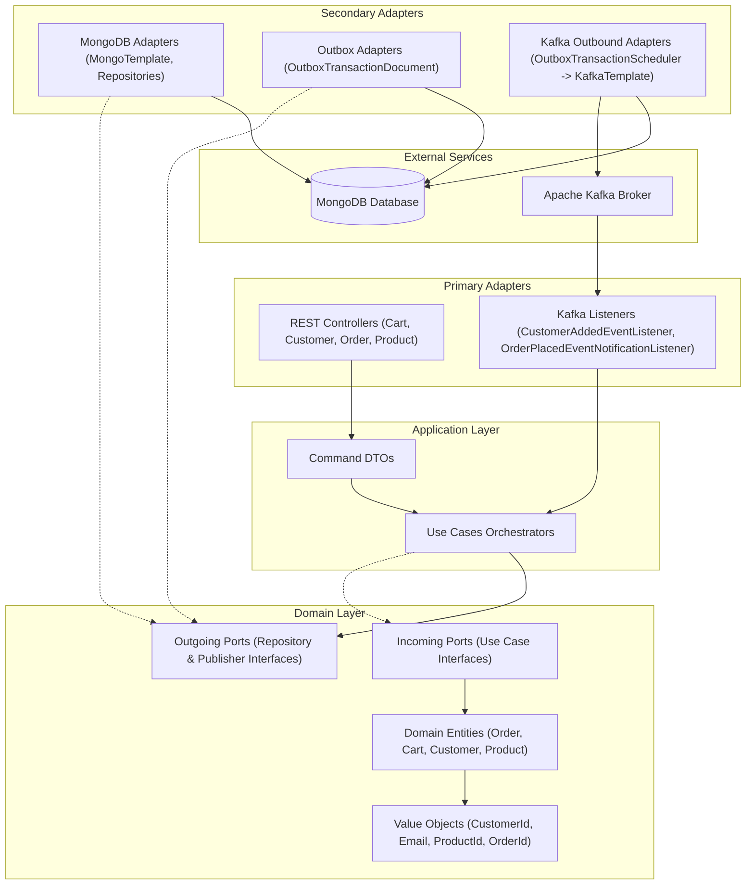

# Cart·AI Shopping


Cart·AI is a modern e-commerce backend platform built to demonstrate clean coding practices, microservices design
patterns, and robust event-driven architecture. The core business focus is the cataloging, shopping cart management, and
ordering of bicycles and related sports equipment.

This project is built using **Hexagonal Architecture (Ports & Adapters)** to keep business logic completely decoupled
from external frameworks, database technologies, and messaging systems.

---

## 🏛️ System Architecture

The project follows a pure Hexagonal Architecture separation, ensuring that the domain model remains free of
infrastructure concerns (like Spring annotations or database entities).



---

## 🛠️ Technology Stack

- **Backend:** Spring Boot 3.5 (Java 21)
- **Database:** MongoDB (Catalog, Outbox, Order, and Cart storage)
- **Event Streaming:** Apache Kafka (Spring Kafka)
- **Build Tool:** Gradle
- **Boilerplate Reduction:** Lombok
- **API Documentation:** Springdoc OpenAPI / Swagger

---

## 🚀 Implemented Patterns & Best Practices

### 1. Transactional Outbox Pattern

To guarantee **At-Least-Once Delivery** and prevent inconsistencies between database updates and event publishing (e.g.,
publishing a message to Kafka for a database transaction that ultimately failed and rolled back), we implement the
Transactional Outbox Pattern:

* Instead of publishing events directly to Kafka in the request thread, events are saved in an `outbox_transaction`
  collection inside MongoDB within the same database transaction as the business entity.
* An
  asynchronous [OutboxTransactionScheduler](file:///Users/rober/IdeaProjects/CartAI/src/main/java/cart/ai/infrastructure/out/kafka/OutboxTransactionScheduler.java)
  polls MongoDB, publishes the events, and updates their status.

### 2. Distributed Locking & Concurrent Mutual Exclusion

To secure the Outbox Scheduler in clustered or multi-instance environments:

* Instead of a simple database fetch-and-update (which causes race conditions where multiple replicas dispatch the same
  message), we use an atomic `findAndModify` operation.
* This operation retrieves a pending message and updates its status to `PROCESSING` in a single atomic step at the
  database level. Other instances are prevented from pulling the same message, ensuring zero duplication at the
  scheduler level.

### 3. Kafka Resilience & Poison Pill Mitigation

* **Centralized Error Handling:** We use a global `CommonErrorHandler` configured with `DeadLetterPublishingRecoverer`
  in [KafkaErrorHandlerConfig](file:///Users/rober/IdeaProjects/CartAI/src/main/java/cart/ai/infrastructure/config/kafka/KafkaErrorHandlerConfig.java).
  This isolates failing payloads to a dedicated `<topic-name>.DLT` topic after 3 failed attempts (1 original + 2
  retries), avoiding partition blockage.
* **ErrorHandlingDeserializer:** Configured
  in [application.properties](file:///Users/rober/IdeaProjects/CartAI/src/main/resources/application.properties) to
  intercept parsing/deserialization errors immediately. This prevents invalid payloads (Poison Pills) from freezing the
  consumer thread.

### 4. End-to-End Idempotency

* **Producer Idempotency:** Enabled via `spring.kafka.producer.properties.enable.idempotence=true` to ensure network
  failures and retries between the application and the Kafka brokers do not write duplicate messages inside the topics.
* **Consumer Idempotency:** Application state validation (e.g., verifying if a shopping cart already exists before
  creating it) is implemented to handle double-delivery scenarios gracefully.

### 5. Strict Event Ordering

* To ensure all actions related to a single customer are processed in the sequence they occurred, events are partitioned
  using the `userId` as the Kafka message key (configured in the Outbox message entity), routing all customer-scoped
  events to the same partition.

---

## 📂 Project Structure

```
src/main/java/cart/ai/
├── application/                      <-- Application Layer (Orchestration & Command Pattern)
│   └── usecases/                     
│       ├── commands/                 <-- Input Command DTOs
│       ├── cart/                     <-- Cart Use Cases (Add, Clear, Get, Remove)
│       ├── customer/                 <-- Customer Use Cases (Create, Get, Update)
│       ├── order/                    <-- Order Use Cases (Cancel, Create, Get)
│       └── product/                  <-- Product Use Cases (Create, Delete, Get, List, Update)
│
├── domain/                           <-- Pure Domain Layer (Framework-free Business Logic)
│   ├── model/                        Entities & Value Objects
│   │   ├── constants/                
│   │   ├── value/objects/            <-- Immutable Value Objects (Records: CustomerId, Email, ProductId, OrderId)
│   │   ├── Cart.java
│   │   ├── Customer.java
│   │   ├── Order.java
│   │   └── Product.java
│   ├── ports/                        <-- Outgoing Ports (Repository & Publisher Interfaces)
│   └── result/                       <-- Error Handling Wrappers
│
└── infrastructure/                   <-- Infrastructure Layer (Frameworks & Adapters)
    ├── config/                       <-- Configurations (Beans, Kafka Error Handlers)
    ├── in/                           <-- Primary / Inbound Adapters (REST, Kafka Listeners)
    │   ├── kafka/                    
    │   └── rest/                     
    └── out/                          <-- Secondary / Outbound Adapters (MongoDB, Kafka Producers)
        ├── kafka/                    <-- Outbox Schedulers & Publishers
        └── persistence/mongo/        <-- Mongo Adapters, Documents, and Mappers
```

---

## 🔮 Future Roadmap

- [ ] **React Frontend Application:**
    - Build a modern user interface using React, TypeScript, and Vite.
    - Leverage HSL-tailored designs, subtle animations, and fully responsive grids for product listing, cart checkout,
      and customer dashboards.
- [ ] **Dockerization & Orchestration:**
    - Containerize the Spring Boot backend, the React frontend, MongoDB, and Apache Kafka.
    - Provide a single `docker-compose.yml` to spin up the entire local development environment instantly.
- [ ] **AWS Cloud Deployment:**
    - Set up secure infrastructure on AWS (EC2/ECS, DocumentDB for Mongo, MSK for Kafka).
    - Implement TLS/SSL security and SASL/SCRAM authentication for Apache Kafka.
- [ ] **Comprehensive Testing Suite:**
    - **Unit & Integration:** JUnit 5, Mockito, and Testcontainers to spin up isolated MongoDB/Kafka instances for
      integration testing.
    - **End-to-End (E2E) / Functional:** Write automated UI and API workflow tests using Playwright.
